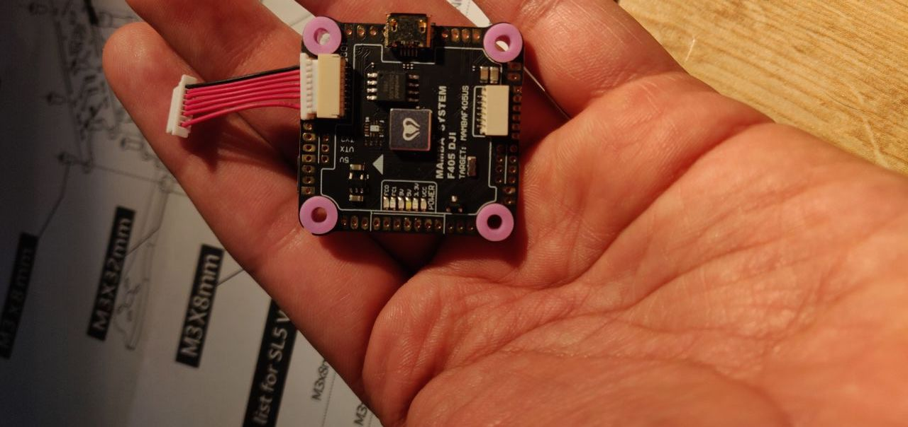
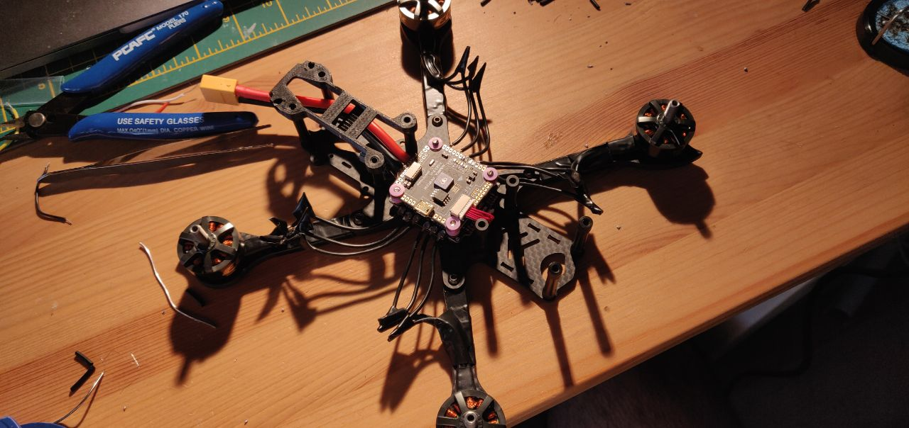

# Building the quad

This post is going to be longer than the previous ones. I will be updating this repo in parts as and when I find the time after every stage of the build.

Get the frame ready. The frame itself comes with several different screws and the frame manufacturer provides one or maybe two extra pieces. So, you will almost never run out of it, unless you don't organise it well. The instruction manual takes a little time to understand, so please spend those few minutes and oragnise the screws, washers and other parts well in advance.

---

Since I started bottom-up - adding frame base, attaching motors and soldering it to the ESC, I realised that the length of the wire is way too long. This is where I made my first mistake. Instead of adjusting the length of the wire (in fear of cutting it short), I soldered it directly onto the ESC. Overall the build quality was looking good at this stage with no shorting. To check if you have a short in your connections, I encourage you to buy yourself a multi-meter. I will update the tools list with this. Multi-meter will save you hundreds of £ by just investing 15-20£ on a decent multi-meter.

---

The Mamba stack has two components - ESC (Electronic Speed Controller) and the Flight Controller. Soldering wires to the ESC is straight-forward. It consists of pads where each of the wires can be soldered onto. Soldering on the ESC is slightly time-consuming, so keep at it for a little while. Since the ESC has a very high rate of heat dissipation, solder iron needs to be kept on it for a few seconds before you start applying the solder on. The challenge however is when you solder the XT receiver. The model that I bought ended up having pins instead of wires. This meant that I needed an extra adapter to that would bite onto the pin and the leads could be soldered onto the flight controller. I instead decided to solder the wiring on the receiver myself and it ended up looking decent. Be sure to change your soldering tip to a thinner one for soldering these points.

Within the Mamba stack, they also provide a capacitor and the XT-60. Be careful to NOT short these two connections when you solder them. This is a bad short circuit and will probably explode the moment you connect your LiPo battery. Again, multimeter to the rescue :) ! Put the multimeter in continuity mode to check if there is a direct shorting between the capacitor and the XT-60 leads.

After trimming the extra length, I could finish the build process of this quad. The overall build quality is not that impressive since I made a few errors initially - wiring trimmings. But, nevertheless, the quad is functional and seems to be alright. Here's a picture of the final build (almost).

---
