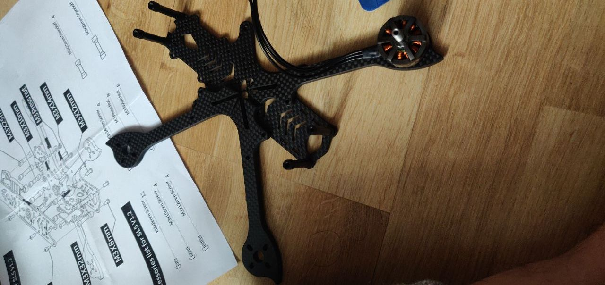
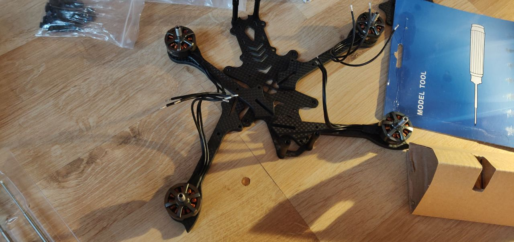
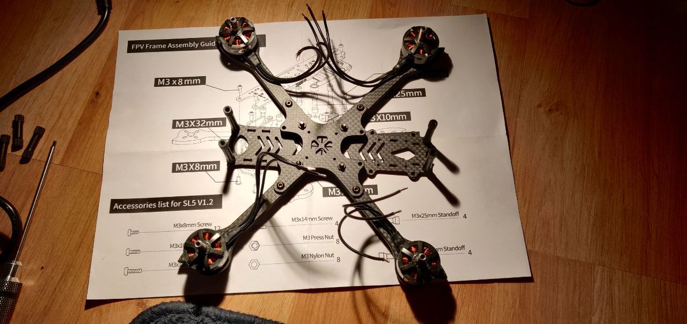
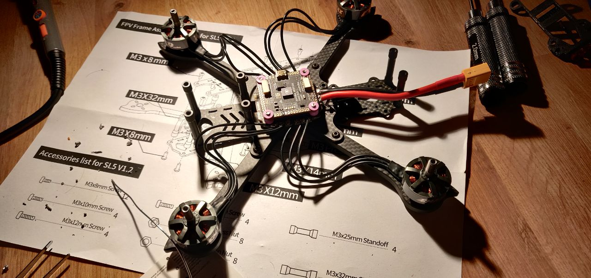

# Building the quad

This post is going to be longer than the previous ones. I will be updating this repo in parts as and when I find the time after every stage of the build.

Get the frame ready. The frame itself comes with several different screws and the frame manufacturer provides one or maybe two extra pieces. So, you will almost never run out of it, unless you don't organise it well. The instruction manual takes a little time to understand, so please spend those few minutes and oragnise the screws, washers and other parts well in advance.

---

Since I started bottom-up - adding frame base, attaching motors and soldering it to the ESC, I realised that the length of the wire is way too long. This is where I made my first mistake. Instead of adjusting the length of the wire (in fear of cutting it short), I soldered it directly onto the ESC. Overall the build quality was looking good at this stage with no shorting. To check if you have a short in your connections, I encourage you to buy yourself a multi-meter. I will update the tools list with this. Multi-meter will save you hundreds of £ by just investing 15-20£ on a decent multi-meter.

---
