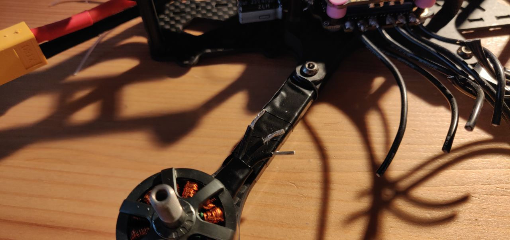

# Getting ready for the build

- For anyone who has never soldered before, you might be nervous (at least I was, even though this wasn't my first time soldering). When you have all the components, the sheer volume of the components will overwhelm you. A lot of wires, screws, washers and plastic pieces to prep up.
- Before you get started on the build, I would advice you to prep up your wire. What does it mean? It means, cut the ends of the wires (if they aren't already) and apply a little bit of solder to it. That way the strains of metal (the core of the wire) does not brush out and mess up your solder.
- Another important thing that I would advice anyone starting with the project is to start bottom up. You may have a preference on how you want to start your build, but I found building the base of the frame and soldering on the motor wires was the best way.
- Be careful on how you solder the wiring. It needs to be soldered inwards so that the wires don't project outwards
- Use a pair of tweezers when soldering wires. Same as the board, wires also heat up when you solder it onto a board
- When you cut the wires for adjusting the length for your motors, PLEASE DO NOT cut it too close to the motor. If by chance you pull out one of them, it is almost impossible to put it back together (unless you know how they are put together). I made that mistake and I rendered one of my motors useless. I had to wait for another month and a half to get some spares.
- I have experimented with a few different temperature setting on the solder iron and found that the solder was consistently good at around 360-380 C. Anything lower, the solder takes very long to start melting. And anything higher, your solder might seep through the board and fall on ICs below. So, please be careful.
- Also remember, the board heats up as you start applying solder on it. The usual practice is to keep the iron on the board and scratch it until the surface gets toasty. That way, the flux or lead easily sticks onto the board.
- 18650 batteries usually have a flat top. Therefore, when you put them inside the transceiver, the switch won't have proper contact. To solve this issue, just use a small piece of solder and spiral it to form the contact between the two batteries.

